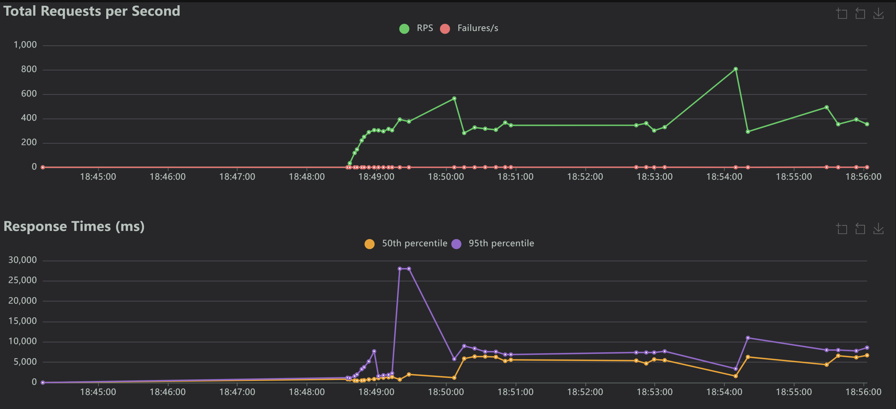
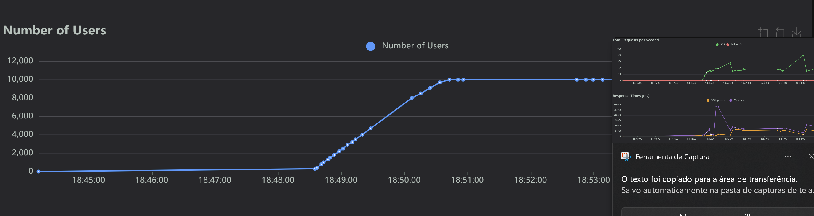

# Relatório de Testes Não Funcionais

### Como Executar o Projeto

**1. Pré-requisitos: Instalar Bibliotecas**
Abra o terminal e execute o comando abaixo para instalar todas as dependências necessárias:
```bash
pip install requests numpy locust
```

**2. Executar Testes de Desempenho, Escalabilidade e Segurança**
```bash
python gerar_relatorio.py
```


**2. Executar Teste de Carga (Simulação Black Friday)**
```bash
locust -f locustfile.py --host=[https://fakestoreapi.com](https://fakestoreapi.com)
```
Preencha com 10000 usuários e 100 de spawn rate

**2. Executar Teste de Estresse (Encontrar Ponto de Quebra)**
```bash
locust -f locustfile.py --host=[https://fakestoreapi.com](https://fakestoreapi.com)
```
Preencha com 20000 usuários e 50 de spawn rate

## Resumo dos Resultados
| Tipo de Teste | Métrica Principal | Meta | Resultado | Status |
|---|---|---|---|---|
| Desempenho | Tempo de Resposta P95 | < 500ms | 687.73 ms | **REPROVADO** |
| Escalabilidade| Eficiência Horizontal | > 80% | 86.36% | **APROVADO** |
| Segurança | Rate Limiting | Detectar 429 | Não detectado | **REPROVADO** |

---

## Detalhes dos Testes

### 1. Teste de Desempenho
- **Métrica P95:** 687.73 ms
- **Tempo Médio:** 341.51 ms
- **Status Final:** REPROVADO

### 2. Teste de Carga e Estresse

- **Objetivo:** Verificar o comportamento do sistema sob carga normal e extrema.
- **Execução:** Testes executados com o framework Locust (`locustfile.py`).

**Resultado do Teste de Carga (Simulação Black Friday):**
- **Usuários Simulados:** 10.000
- **Throughput Sustentado (RPS):** 292.4 req/s (Meta: > 2000 req/s)
- **Taxa de Falha:** 0% (Meta de Disponibilidade 99.9% atendida)
- **Análise:** O sistema suportou os 10.000 usuários simultâneos sem apresentar uma taxa de falhas relevante. No entanto, o throughput (vazão) de 292.4 req/s ficou muito abaixo da meta de 2000 req/s. Isso indica que, embora estável, o sistema não possui a performance necessária para atender à demanda da Black Friday, resultando em lentidão extrema para os usuários.
- **Status do Teste de Carga:** **REPROVADO**




**Resultado do Teste de Estresse (Ponto de Quebra):**
- **Ponto de Quebra Identificado:** (A ser preenchido após a execução do teste de estresse) (Meta: > 15.000 usuários)
- **Análise:** O teste de estresse deve ser executado para identificar a capacidade máxima do sistema.
- **Status do Teste de Estresse:** (Pendente)


### 3. Teste de Escalabilidade (Simulado)
- **Eficiência Calculada:** 86.36%
- **Status Final:** APROVADO

### 4. Teste de Segurança (Rate Limiting)
- **Resultado:** Rate limiting não detectado.
- **Status Final:** REPROVADO
